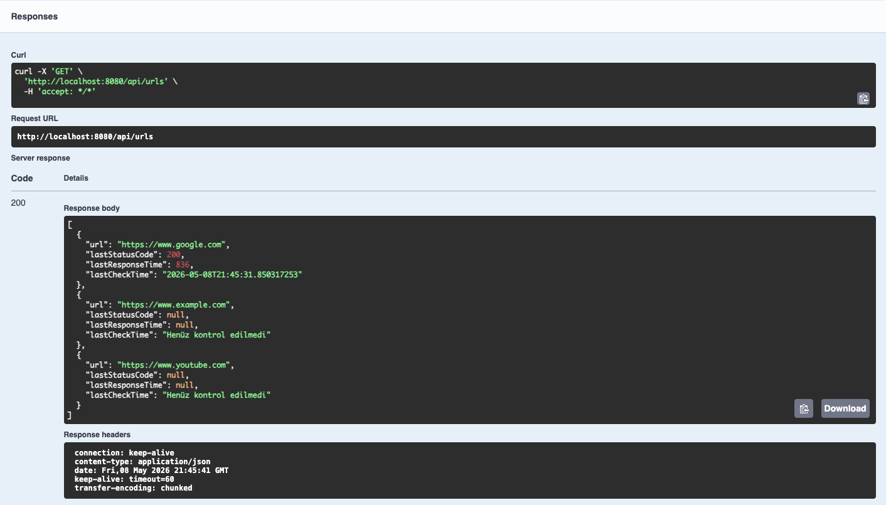
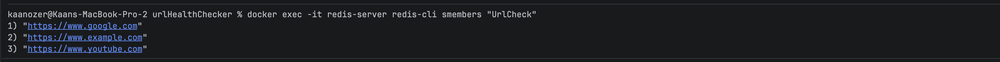
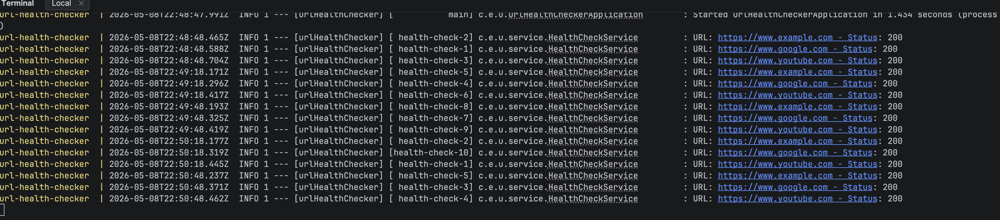
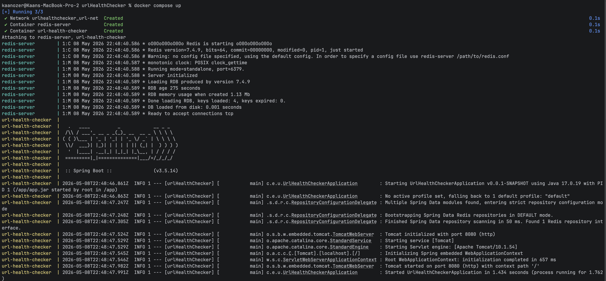

# Multithreaded URL Health Checker

Bu proje, kayıtlı URL'lerin sağlık durumlarını (HTTP Status Code, Response Time) periyodik olarak kontrol eden, Redis tabanlı, yüksek performanslı ve asenkron bir Spring Boot uygulamasıdır.

---

## 📋 İçindekiler
1. [🌟 Öne Çıkan Ekstra Özellikler](#-öne-çıkan-ekstra-özellikler)
2. [🏗 Mimari Özet ve Çalışma Mantığı](#-mimari-özet-ve-çalışma-mantığı)
3. [🛠 Çalıştırma Adımları](#-çalıştırma-adımları)
4. [🧪 Test Süreci (Otomatize ve Manuel)](#-test-süreci-otomatize-ve-manuel)
5. [📡 Endpoint Örnekleri (cURL)](#-endpoint-örnekleri-curl)
6. [⚙️ Konfigürasyon](#-konfigürasyon)
7. Screenshots

---

## Öne Çıkan Ekstra Özellikler

*   **Lombok & Swagger Entegrasyonu:** Kod temizliği için Lombok, API'nin dökümantasyonu ve kolayca manuel test edilebilmesi için Swagger UI (OpenAPI 3) kullanılmıştır. (/swagger-ui/index.html)
*   **Global Exception Handling:** Uygulama genelinde oluşabilecek tüm istisnai durumlar merkezi bir `GlobalExceptionHandler` ile yakalanarak kullanıcıya standart hata mesajları dönülmektedir.
*   **Docker Volumes:** Redis verilerinin konteyner kapansa dahi kaybolmaması için Docker Volume yapısı kullanılarak veri kalıcılığı (persistence) garanti altına alınmıştır.
*   **Ek Test Yazımı** Uygulamada ek olarak **Unit Test** (Service mantığı), **Validation Test** (Hatalı girişlerin denetimi) ve **Integration Test** (Uygulama bağlamı) olmak üzere 3 farklı katmanda testler kurgulanmıştır.
*   **Çift Havuzlu Asenkron Mimari (Dual-Pool Async):** Sistemde "Health Check" ve "Redis Write" işlemleri için iki ayrı thread havuzu (`ThreadPoolTaskExecutor`) tanımlanmıştır. Bu sayede ağ gecikmeleri ile veritabanı yazma süreçleri birbirinden izole edilerek sistemin darboğaz (bottleneck) oluşması engellenmiştir.
    *   **Dinamik Parametre Yönetimi:** Havuz boyutları kod içerisinde sabit (hardcoded) tutulmamış; `application.yml` üzerinden dışsallaştırılmıştır.
        *   `health-check-size: 10` -> Dış ağ sorguları için 10 paralel kanal.
        *   `redis-write-size: 5` -> Veritabanı yazma işlemleri için 5 paralel kanal.
*   **Aktif DTO Yapısı:** Veritabanı modelleri (`UrlRecord`) ile API giriş/çıkış nesneleri (`UrlCreateRequestDto`, `UrlResponseDto`) tamamen ayrılmıştır. Bu sayede veri kapsülleme (encapsulation) ve API stabilitesi sağlanmıştır.
* **Docker Healthcheck & Dependency Management:**  Docker Compose seviyesinde Redis için `healthcheck` (redis-cli ping) tanımlanmıştır. Uygulama servisi, Redis'in tamamen hazır olmasını bekleyen (`service_healthy`) bir bağımlılık hiyerarşisiyle çalışır.

---

## 🏗 Mimari Özet ve Çalışma Mantığı

Uygulama, yüksek trafikli sistemlerde darboğaz oluşmasını engelleyen **"Event-Driven & Non-blocking"** prensiplerine uygun katmanlı bir mimariyle tasarlanmıştır.

### 1. Katmanlı Yapı (Layered Architecture)

*   **Controller:** API giriş noktasıdır. `UrlCreateRequestDto` ile gelen verileri doğrular (Validation) ve kullanıcıya `UrlResponseDto` döner.
*   **Service:** İş mantığını içerir. `UrlService` veri yönetimini, `HealthCheckService` ise asenkron kontrol süreçlerini yürütür.
*   **Repository:** Spring Data Redis kullanarak `UrlRecord` modellerinin CRUD operasyonlarını yönetir.
*   **Model:** Sistemin veri şemasını temsil eden `UrlRecord` sınıfını (Redis Hash) barındırır.
*   **DTO (Data Transfer Object):** Veritabanı modellerini dış dünyadan soyutlar. Güvenlik ve veri gizliliği için aktif olarak kullanılır.
*   **Exception:** `GlobalExceptionHandler` ile merkezi hata yönetimi sağlar. Hataları yakalayarak kullanıcıya standart JSON formatında yanıt döner.
*   **Config:** Uygulamayı yapılandırır:
    *   `AsyncConfig`: Çift kanallı thread havuzlarını kurar.
    *   `OpenApiConfig`: Swagger/OpenAPI 3 entegrasyonunu sağlar.
    *   `RestClientConfig`: HTTP bağlantı ayarlarını optimize eder.
*   **Scheduler:** Periyodik görevlerin (30sn) tetikleyici merkezidir.

### 2. Asenkron İş Akışı (Workflow)
Projenin temelini oluşturan sağlık kontrolü süreci şu adımlarla işler:
1.  **Tetiklenme:** `HealthCheckScheduler`, yapılandırılan periyotla (30sn) uyanır ve `UrlService` üzerinden tüm kayıtları çeker.
2.  **Dağıtım (Pool 1):** Her bir URL kontrolü, `healthCheckExecutor` havuzuna bir görev (task) olarak fırlatılır. Bu sayede 10 URL varsa, 10'u aynı anda kontrol edilmeye başlanır.
3.  **Ayrışma (Pool 2):** Dış dünyaya atılan HTTP isteği sonuçlandığında, yazma işlemi ana thread'i bekletmez. Sonuçlar `redisWriteExecutor` havuzu üzerinden asenkron olarak Redis'e işlenir.
4.  **Sonuç:** Ağ gecikmeleri (Network Latency) uygulamanın genel performansını etkilemez; sistem her zaman akıcı ve duyarlı kalır.


## Klasör Yapısı

```
urlHealthChecker/
├── Dockerfile
├── docker-compose.yml
├── .dockerignore
├── .gitignore
├── README.md
├── pom.xml
└── src/
    └── main/
        ├── java/com/example/urlhealthcheck/
        │   ├── UrlHealthCheckApplication.java
        │   ├── config/
        │   │   ├── AsyncConfig.java
        │   │   ├── OpenApiConfig.java
        │   │   └── RestClientConfig.java
        │   ├── controller/
        │   │   └── UrlController.java
        │   ├── dto/
        │   │   ├── UrlCreateRequestDto.java
        │   │   └── UrlResponseDto.java
        │   ├── exception/
        │   │   └── GlobalExceptionHandler.java
        │   ├── model/
        │   │   └── UrlRecord.java
        │   ├── repository/
        │   │   └── UrlRecordRepository.java
        │   ├── scheduler/
        │   │   └── HealthCheckScheduler.java
        │   └── service/
        │       ├── HealthCheckService.java
        │       └── UrlService.java
        └── resources/
            └── application.yml
```
---

## 🛠 Çalıştırma Adımları

Projeyi çalıştırmak için sisteminizde Docker ve Docker Compose yüklü olması yeterlidir:

1.  **Projeyi Klonlayın:**
    ```bash
    git clone https://github.com/kaan-ozer/urlHealthChecker.git
    cd urlHealthChecker
    ```
2.  **Docker ile Ayağa Kaldırın:**
    ```bash
    docker-compose up --build -d


###    🧪 Test Süreci (Otomatize ve Manuel)

####  Otomatize Testler (Maven)

Ana dizinde şu komutu vermeniz yeterlidir:

```Bash
cd urlHealthChecker
mvn test
```

#### Manuel Test (Swagger UI)

Endpoint: /swagger-ui/index.html

Kullanım: POST ile URL ekleyebilir, GET ile asenkron güncellenen sonuçları izleyebilirsiniz.

#### 📡 Endpoint Örnekleri (cURL)

######  Yeni URL Ekleme

```Bash
curl -X POST http://localhost:8080/api/urls \
     -H "Content-Type: application/json" \
     -d '{"url": "[https://www.google.com](https://www.google.com)"}'
```
######  Tüm URL'leri Listeleme

```Bash
curl -X GET http://localhost:8080/api/urls
```

###   ⚙️ Konfigürasyon

application.yml içerisine gidilerek thread sayıları güncellenebilir.

```Bash
app.thread.health-check-size: 10 (Paralel kontrol sayısı)

app.thread.redis-write-size: 5 (Redis yazma thread sayısı)

app.scheduler.rate: 30000 (Kontrol periyodu - ms)
```

Geliştirici: Kaan Özer

Tarih: Mayıs 2026

###   Screenshots
 
  
 
  
 
  

  
 
